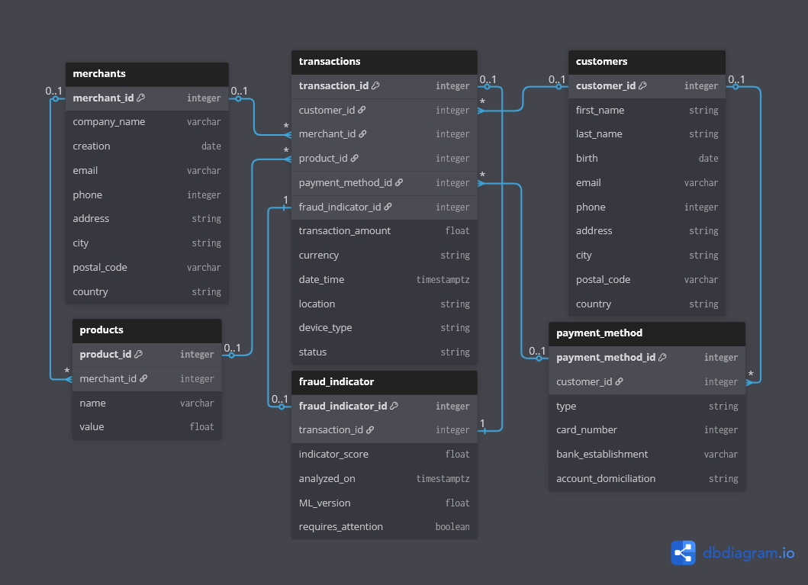

Let's dive deeper into our core components with how the OLTP is organized!

Whenever a new transaction is emitted through Stripe, the signal received would contain a wealth of informations divided into several tables. The central one, **transactions** would store the data pertaining to the very trade: it should have its own id for individual retrieval (primary key), be able to refer to the ids of the customer (buyer), the merchant (seller), the product, the payment method, and the fraud analysis (or indicator). Consequently, these five represent the other tables revolving around this central one and as such, all five are foreign keys.

To remain focused on the **transactions** table, it should be able to store the remaining key informations of the trade: the amount transferred must be included, as well as its currency which we would expect to already be in a format pertaining to our reference table, thus not requiring to duplicate said reference currency table (for the information will be available downstream in the OLAP). Obviously it should have the date & time of the transaction, including the timezone of the transfer in its format; the associated location would be stored through the IP address of the transaction, while the device type used to conclude it should be stored depending a list upstream of usable devices for Stripe's system. Finally, the status of the transaction should be readable: whether it was succesfully completed, failed, or refunded.

Let's move on to the other tables! Remember we imported some references; those would be the merchants table and their **product** catalogs. The catalogs should be stored within a single table where each product has its own id (primary key to be called as a foreign one by the transactions table), name and value, but still refer to whichever merchant it belongs to by referencing the merchant id. Cardinality-wise, a transaction should refer only to a single product which initiated said transaction (with 0 simulating either the very bootup of our system, either a worrisome issue in the system) while on the opposite way a single product can be found in several transactions. As for the merchant relation, a product should be related to a single merchant at most (or none if creating product files before registering the soon-to-be merchant) while a single merchant could offer several products.

Now to explore the second reference table we imported, the **merchants**: we should be able to identify an unique id (primary key to be called as a foreign one by the transactions table), while the table itself would store the company name, its date of creation, email, phone, and physical location divided into several components (address, city, postal code & country). For cardinalities, again as we stated earlier a single merchant should be able to refer to several products, while a precise product should refer to a single merchant; when it comes to transactions, a specific transaction should only refer to a single merchant, while a precise merchant could be involved in several transactions.

This time we'll jump to the other side of our schema, with the **customers** table! With a single id as primary key to identify them, we should be able to recover in this table the customer's first & last names, their date of birth, email, phone (with international numbers like French ones starting with +33 being converted into an integer as 0033), and location again divided in four parts (address/city/postal code/country). For cardinalities, a target transaction should be able to refer only to a single customer, while on the opposite a single customer could have initiated many transactions. For the payment method, if a specific method would only be associated to a single customer, said customer could have many payment methods at their disposal.

Let's follow up with these **payment methods**: even though we're dealing with transactions, we're not guaranteed to always have absolutely all bank data available (at least in France, in the case of a payment by credit, the Bank of France will withhold the information about the source of funds and only emit whether the payment can be done or not). Still we will want to identify each payment method by an unique id (primary key), make it able to call which customer is that method associated with (foreign key), and store a few informations: what type of payment is it able to perform (debit, credit), the card number where applicable, the related bank establishment, and if possible the precise account domiciliation for our fraud analysis (especially to identify associated countries). Cardinality-wise, again a payment method should only relate to a single customer while said customer could have several methods of payment; and as payment methods are also associated to transactions, a target transaction should only have a single payment method, while a precise method could be used to pay many transactions.

Let's wrap up now with our remaining table: the **fraud indicator**! Each analysis should have their own unique id (primary key) and refer to the analyzed transaction's id (foreign key), as the fraud detection app of our system feeds this table also with a score of anomaly (or "indicator score"), the precise date and time including timezone when was that analysis processed, which ML version was used (as the method to identify the model) and finally a boolean flag should the transaction urgently require human attention. Cardinalities in this case are very straightforward: a specific fraud indicator could only refer to a single transaction, while said transaction can only refer to its own indicator. The duplication of the transaction id (when it could only have been about the indicator id) is due to the way our detection app works: in our global architecture said app is decoupled from OLTP ingestion at first and only feeds the OLTP once the analysis is performed, hence the need of a common information for the pipeline to properly forward the data - thus this duplicated transaction id to inject data straight into this table.

That's it for our OLTP!