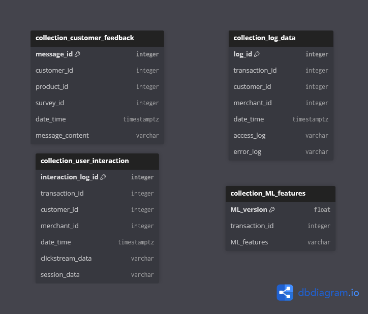

This time, let's observe what our pipelines feed our noSQL component with, that our OLTP cannot reasonably handle!

As we resort to MongoDB, our noSQL system is thus based on a document-oriented database. This one will thus offer the four collections expected by our instructions: log data, customer feedback, user interaction and ML features.

Let's first review what our **log data** would be storing: a new transaction would generate a new document in this collection by creating an unique identifier (primary key), storing the ids of the related transaction and either merchant (initiating a refund for a customer) or customer's id (all other cases), providing the date & time (with timezone) at which the two following logs are produced: the system access and any error log where applicable. For the latter, if there are no errors our downstream pipelines should be able to consider a blank field.

Next comes our **customer feedback**: whichever the nature of the customer message, since our system revolves around transactions we will presume this feedback is made available straight after paying. Thus we will want to uniquely identify the message (primary key), have it associated to the transaction's id and recover the customer's own id; then our feedback branches off into two possibilities following our instructions. It could be a product review, at which point we want the associated product's id and possibly a note for rating; or it could be the reply to a survey, at which point said survey should have its own unique id to be identified. In any case the feedback should have its own date & time (with timezone), and obviously provide in a column its full content.

Then for our **user interaction**: on each transaction generated, the system should be able to recover all interaction data associated to it. Thus it would produce an interaction log with its unique id (primary key), storing the related transaction's id, the user id (either the merchant's when initiating a refund, either the customer in all other cases - generating an empty field for the case that doesn't apply for consideration by our downstream pipelines), the date & time (with timezone) when was this data generated, and both logs associated to the user interaction: their clickstream and the session data.

Finally, our **ML features** collection would be fed straight by our fraud detection app, by recovering the model's version as its identifier & primary key, the associated transaction id to the analysis, and the variety of features used in the detection.

That's it for our noSQL!